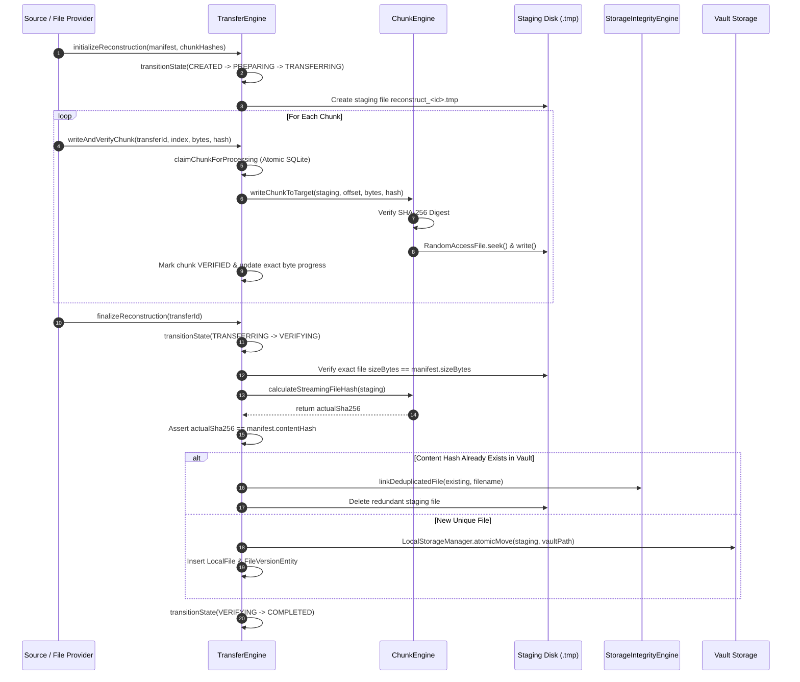

# InternetStorer 3.0

> **Your digital world, wherever you are.**

[](https://kotlinlang.org)
[](https://developer.android.com)
[](https://developer.android.com/jetpack/compose)
[](https://developer.android.com/training/data-storage/room)
[](https://developer.android.com/privacy-and-security/cryptography)
[](LICENSE)

---

## 1. Truthful Product Positioning

InternetStorer 3.0 is a **secure, offline-first digital continuity engine** for Android. It ensures that critical files, documents, records, and media remain available, verifiable, and protected when completely disconnected from the Internet or cellular infrastructure.

### What InternetStorer IS:
- **A Resilient Local Storage Vault:** An encrypted, sandboxed local repository protected by hardware-backed Android Keystore cryptography (AES-256-GCM).
- **A Resumable Chunking & Transfer Engine:** A streaming file-transfer foundation that breaks large files into verifiable chunks, validates them with SHA-256 digests, and guarantees atomic reconstruction.
- **A Self-Healing Integrity Engine:** A verification subsystem that continuously scans for missing files, orphan disk data, and bitrot corruption, safely deduplicating identical files via reference counting.
- **A Purely Autonomous Offline Application:** Built from the ground up to operate with zero dependencies on remote servers, cloud accounts, or active telecommunication towers.

### What InternetStorer IS NOT:
- **NOT a "Free Internet" or Cellular Data Bypass:** It does not bypass mobile carrier plans, store cellular bandwidth, or generate telecommunication signals out of thin air.
- **NOT a Cloud Proxy:** It cannot cause online-only third-party services (e.g., social media streaming or remote cloud APIs) to function without actual physical connectivity.
- **NOT Fake or Simulated:** It contains zero fake progress bars, zero simulated network peers, and zero synthetic latency. All storage and transfer foundations perform real streaming I/O and cryptographic calculations.

---

## 2. System Architecture & Workflows

InternetStorer adheres strictly to **Clean Architecture** and **MVVM** patterns with unidirectional data flow (UDF).

```
┌────────────────────────────────────────────────────────────────────────┐
│                          Presentation Layer                            │
│  Jetpack Compose M3 UI Screens  •  StateFlow  •  Navigation Compose    │
└───────────────────────────────────┬────────────────────────────────────┘
                                    │
                                    ▼
┌────────────────────────────────────────────────────────────────────────┐
│                            Domain Layer                                │
│   Use Cases  •  Domain Models  •  Repository Interfaces (Contracts)    │
└───────────────────────────────────┬────────────────────────────────────┘
                                    │
                                    ▼
┌────────────────────────────────────────────────────────────────────────┐
│                             Data Layer                                 │
│   Repository Implementations  •  Room Database v3  •  Preferences      │
└───────────────────┬────────────────────────────────┬───────────────────┘
                    │                                │
                    ▼                                ▼
┌─────────────────────────────────────┐  ┌───────────────────────────────┐
│       Core Storage Subsystems       │  │    Core Security & Work       │
│  • LocalStorageManager (Sandbox)    │  │  • AndroidKeystoreSecurity    │
│  • ChunkEngine (Streaming 8KB I/O)  │  │  • AES-256-GCM Cipher         │
│  • FileManifestManager (SHA-256)    │  │  • TransferChunkWorker        │
│  • TransferEngine (State Machine)   │  │  • OfflineOperationWorker     │
│  • StorageIntegrityEngine           │  │  • NetworkConnectivityMonitor │
└─────────────────────────────────────┘  └───────────────────────────────┘
```

### 2.1 Resumable Chunk Reconstruction Flow



---

## 3. Core Engine Components

### 3.1 Streaming Chunk Engine (`ChunkEngine`)
- **Memory Bounded:** Uses an 8 KB buffer for streaming SHA-256 hashing. Operates in constant memory ($O(1)$ space complexity) regardless of file size.
- **Configurable Chunking:** Default 64 KB chunk size with boundary verification. Final partial chunks are calculated deterministically.
- **Random Access Writing:** Employs `RandomAccessFile` in read/write mode with explicit file descriptor flushing (`channel.force(true)`).

### 3.2 Canonical Manifest Manager (`FileManifestManager`)
- **Deterministic Serialization:** Generates standard JSON manifests with ordered keys.
- **Security Boundaries:** Rejects filenames containing path traversal characters (`..`), null bytes (`\0`), or carriage returns/newlines (`\r`, `\n`).
- **Cryptographic Validation:** Validates that content hashes are strictly 64-character hexadecimal strings and verifies chunk count arithmetic against declared byte sizes.

### 3.3 Transfer State Machine (`TransferEngine`)
- **Strict State Flow:**
  $$\text{CREATED} \longrightarrow \text{PREPARING} \longrightarrow \text{TRANSFERRING} \longrightarrow \text{VERIFYING} \longrightarrow \text{COMPLETED}$$
- **Exceptional Handling:** Supports `PAUSED`, `INTERRUPTED`, `FAILED`, and `CANCELLED`.
- **Atomic Concurrency Protection:** Employs atomic SQLite conditional updates (`transitionState` and `transitionStateFromAllowed`) and atomic chunk claiming to prevent duplicate processing by concurrent worker threads.
- **Process Death Recovery:** When the app restarts after process death or battery depletion, `recoverInterruptedTransfers` gracefully transitions in-flight transfers to `INTERRUPTED`, allowing resumption without data corruption.

### 3.4 Storage Integrity & Deduplication Engine (`StorageIntegrityEngine`)
- **Evidence Preservation:** Scans the entire vault against the database. If file corruption is detected, the database marks the record as `CORRUPTED` and preserves the physical file on disk for forensic recovery—it is never automatically deleted.
- **Orphan File Ingestion:** Any unindexed files found in the vault directories are ingested and cataloged with freshly computed streaming SHA-256 digests.
- **Thread-Safe Deduplication & Reference Counting:** When an incoming file matches an existing SHA-256 hash, a duplicate database record is created referencing the existing physical file path. The reference count is incremented transactionally. Physical deletion occurs **only** when the reference count reaches zero.

---

## 4. Security & Cryptographic Architecture

| Security Domain | Implementation Detail | Invariant Guaranteed |
| :--- | :--- | :--- |
| **Authenticated Encryption** | AES-256 in Galois/Counter Mode (`AES/GCM/NoPadding`) | Confidentiality and integrity with 128-bit authentication tag. |
| **Key Management** | Hardware-backed Android Keystore (`AndroidKeyStore`) | Private keys never exposed in app memory or logs. |
| **Initialization Vectors (IV)** | 12-byte cryptographically secure random IV per file | Zero IV reuse; prepended to the ciphertext header. |
| **Filesystem Sandboxing** | `context.filesDir/internet_storer_vault` | Path traversal attacks (`../`) are blocked at canonical resolution. |
| **Zero Network Telemetry** | No analytics, trackers, or external HTTP requests | Zero data leakage to external networks. |

---

## 5. Development Roadmap

```
  [ PHASE 01 ] Complete & Audited
  ├── Project Identity & Dark/Light Romantic UI Theme
  ├── User Profile Setup & Offline Readiness Calculations
  └── System Connectivity State Observers

  [ PHASE 02 ] Complete & Audited
  ├── Local Encrypted Vault Storage (AES-256-GCM)
  ├── Room Database v2 (Operations, Events, Quotas)
  └── Offline Operation Engine & Background Recovery Worker

  [ PHASE 03 ] Complete & Audited (CURRENT)
  ├── Canonical File Manifests (SHA-256 Verification)
  ├── Streaming Chunk Engine & Boundary Math
  ├── Transfer State Machine & Concurrency Guard
  └── Storage Integrity Engine & Deduplication (Reference Counting)

  [ PHASE 04 ] Future Phase (Planned)
  ├── Peer-to-Peer Transport Foundation
  ├── Local Wi-Fi Direct & Wi-Fi Aware Abstractions
  └── Bluetooth Low Energy (BLE) Nearby Discovery

  [ PHASE 05 ] Future Phase (Planned)
  ├── Store-and-Forward Mesh Relay
  └── End-to-End Encrypted Offline Messaging

  [ PHASE 06 ] Future Phase (Planned)
  └── Embedded Local AI (On-Device Inference & Local RAG)
```

---

## 6. Build, Test & Verification

### Prerequisites
- Android Studio Ladybug / Meerkat or command-line Gradle toolchain
- JDK 17 or JDK 21
- Android SDK 35 (Android 15) with Build Tools 35.0.0

### Running Unit & Robolectric Tests
```bash
# Execute the complete unit test suite across all phases
gradle :app:testDebugUnitTest
```

### Compiling Debug APK
```bash
# Assemble the debug build
gradle :app:assembleDebug
```

---

## 7. Project Structure

```
app/src/main/java/com/example/
├── InternetStorerApplication.kt          # Application class & DI container init
├── MainActivity.kt                       # Single-activity Compose host
├── core/
│   ├── connectivity/                     # Network state observer & telemetry
│   ├── database/                         # Room v3 schema, entities, and DAOs
│   ├── datastore/                        # Jetpack DataStore preferences
│   ├── navigation/                       # Navigation Compose graph & routes
│   ├── offline/                          # Offline operation engine & local event bus
│   ├── security/                         # Android Keystore AES-256-GCM manager
│   ├── storage/                          # ChunkEngine, ManifestManager, IntegrityEngine
│   ├── transfer/                         # TransferEngine state machine & assembly
│   ├── ui/components/                    # Reusable Material 3 UI design components
│   └── work/                             # Background recovery workers (WorkManager)
├── data/
│   ├── AppContainer.kt                   # Central dependency injection container
│   └── repository/                       # Repository implementations
├── domain/
│   ├── model/                            # Clean domain data models & errors
│   ├── repository/                       # Repository interface contracts
│   └── usecase/                          # Pure business logic use cases
├── features/
│   ├── home/                             # Home dashboard & status cards
│   ├── main/                             # Bottom navigation & scaffold host
│   ├── onboarding/                       # Onboarding carousel
│   ├── operations/                       # Offline operations queue monitor
│   ├── profile/                          # User profile setup & storage preferences
│   ├── settings/                         # Storage, connectivity, and privacy settings
│   ├── splash/                           # Animated splash screen
│   ├── transfers/                        # Transfers dashboard, detail & reconstruction
│   └── vault/                            # File vault manager, search, and categorization
└── ui/theme/                             # M3 ColorScheme, Typography, Shapes
```

---

## 8. Performance Architecture & UI Responsiveness

InternetStorer 3.0 has undergone strict performance profiling and optimization to ensure sub-16ms frame times, smooth 60/120fps scrolling, and instantaneous tab switching:

- **Zero Main-Thread File I/O:** All cryptographic hashing (SHA-256), AES-256-GCM encryption/decryption, chunk manipulation, and database operations execute strictly on Kotlin `Dispatchers.IO`.
- **Database-Aggregated Storage Metrics:** Vault and device storage metrics are computed using indexed SQLite aggregations (`SUM(sizeBytes)`), completely bypassing recursive file-tree traversals (`File.walkTopDown()`) during screen rendering and navigation transitions.
- **Indexed Schema (Database v4):** `local_activity(timestamp)` contains an explicit B-tree index, guaranteeing constant-time lookup for recent activity feeds and event logging.
- **Non-blocking Screen Initialization:** Heavy integrity verifications and background reconstructions never execute on ViewModel `init`. Screen rendering happens immediately; integrity scans run on-demand or via scheduled background workers (`WorkManager`).
- **Lifecycle-Aware State Collection:** Jetpack Compose screens subscribe to reactive flows via `collectAsStateWithLifecycle()`, stopping flow collection and eliminating unnecessary recompositions whenever screens are hidden or paused.
- **Hardware-Accelerated Layer Rendering:** Continuous ambient and breathing animations leverage `Modifier.graphicsLayer` transformations (`scaleX`, `scaleY`), eliminating layout remeasurement passes and running directly on the GPU render node.
- **Allocation & GC Optimization:** Formatter instances (`SimpleDateFormat`) are cached per timestamp using `remember`, eliminating garbage collection pauses during continuous list scrolling.

---

## 9. License & Attribution

```
Copyright 2026 Simon Baler. All rights reserved.

Licensed under the Apache License, Version 2.0 (the "License");
you may not use this file except in compliance with the License.
You may obtain a copy of the License at

    http://www.apache.org/licenses/LICENSE-2.0

Unless required by applicable law or agreed to in writing, software
distributed under the License is distributed on an "AS IS" BASIS,
WITHOUT WARRANTIES OR CONDITIONS OF ANY KIND, either express or implied.
See the License for the specific language governing permissions and
limitations under the License.
```
